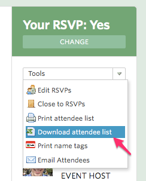

# meetup-raffler
A simple Python script to raffle items to attendees at a meetup.

First used (with some success) at [Django-district's Django birthday party](http://www.meetup.com/django-district/events/223902619/):


## Use it for your meetup

To use this script at your meetup, all you need is a computer with Python 2.7+ and access to the Meetup administrator tools for a specific event.

To run your own raffle:

1. Go to the Meetup.com page for your event and click "Download attendee list" under "Tools" in the sidebar (or use the `sample_attendees.csv` file in this repo):
    

    **NOTE:** You cannot do this for past meetups - so be sure to export this list the day of your event (which is probably when you want to run the raffle anyway)
1. Open the `.xls` file Meetup provides and re-save it as a `.csv` file using an application like [Excel](https://products.office.com/en-us/excel) or [Numbers](https://www.apple.com/mac/numbers/).
1. Clone this repository - or just download the `raffle.py` file with `curl`:

    ```
    curl -O https://raw.githubusercontent.com/django-district/meetup-raffler/master/raffle.py
    ```

1. Open a terminal session and run this command:

    ```
    python raffle.py /PATH/TO/YOUR/attendee_list.csv
    ```

If everything goes right, you'll see some output that looks like this:

```
AND THE WINNER IS...
Andrew T. Baker (http://www.meetup.com/django-district/members/43552892/)
```

The script provides the winner's name and a link to their Meetup profile for your group - just in case you have two people with the same name and need to see a photo.

## Improve this script

Contributions are welcome! Just fork this repository and submit a PR!

Here are some things that could be improved:

- **Reducing the liklihood of duplicate winners** - this happened a lot at the Django birthday party. Come up with some way to take an attendee out of the list of entrants after they've already won
- **Alter the script to use the `.xls` file as its input** - this would save users the hassle of converting their attendee list to a `.csv` before running their raffle
- **Make the script Python 2/3 compatible** - right now it only works with Python 2
- **Use a library like click to make the script more user-friendly** - click is a great Python library for making command line tools
- **Add the script to PyPI** - this way other people can use it by running `pip install meetup_raffler`
